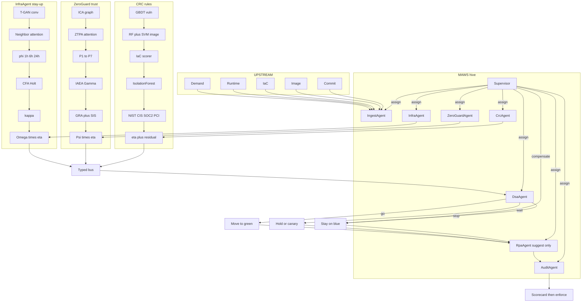
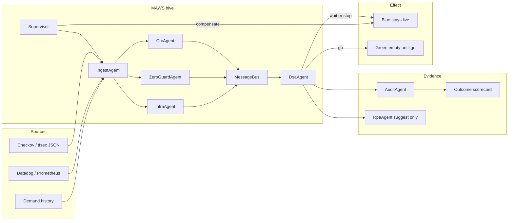
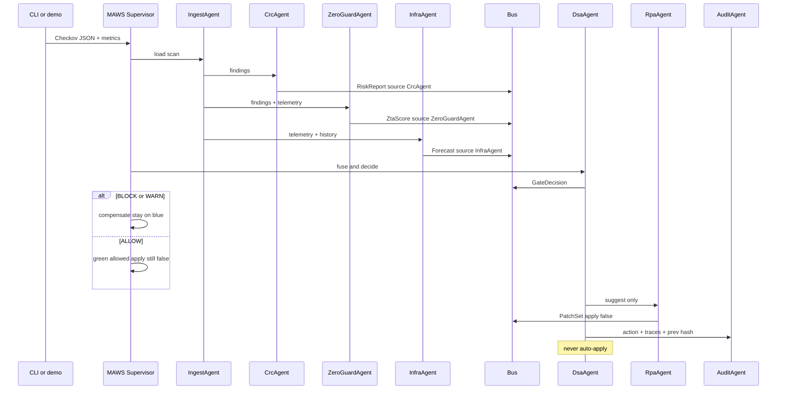
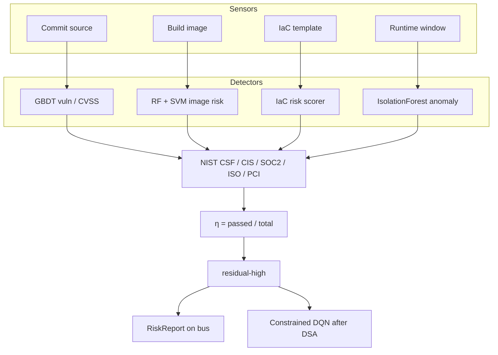
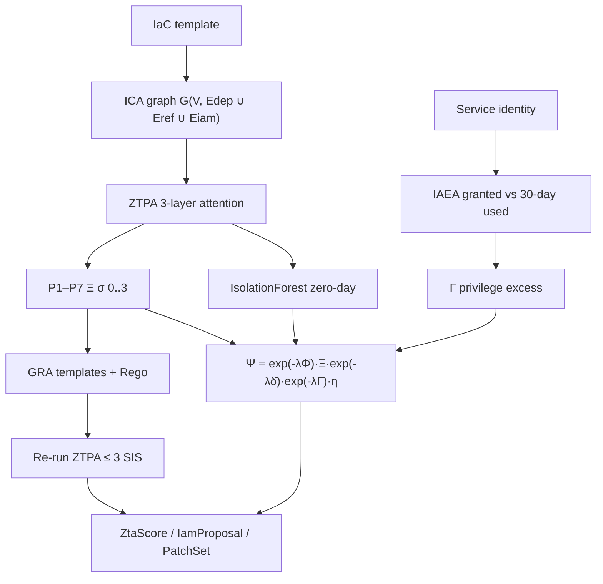
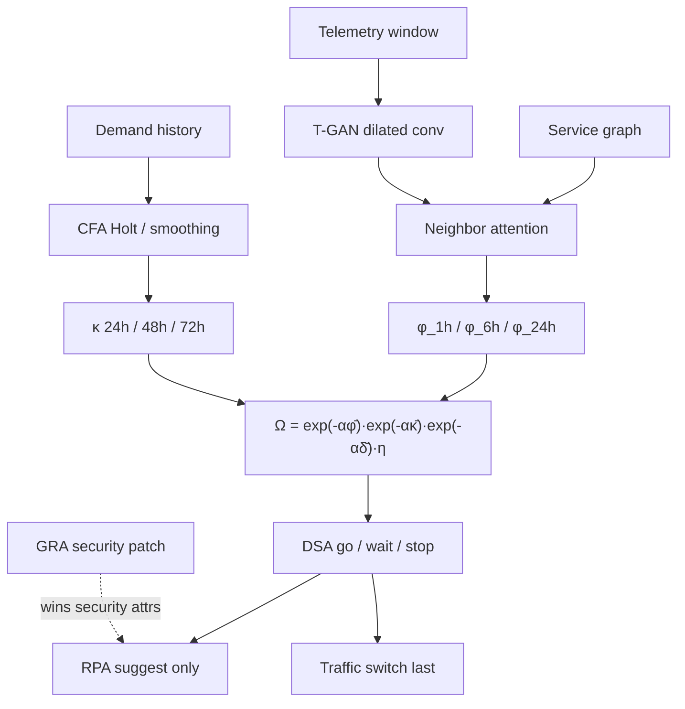

# Complete architecture

Three scoring papers plus a **MAWS hive**. CRC, ZeroGuard, and InfraAgent still share a bus, a signed audit, and a **single go / wait / stop**. [MAWS](https://github.com/harishapuri/MAWS) is the supervisor: it assigns named agents, publishes on the bus, and compensates stop/wait by staying on blue. It is not a fourth score. The bank chatbot is the illustration at the bottom — not a separate product.

## All in one — MAWS hive, upstream to downstream



CRC still runs **before** ZeroGuard and InfraAgent because η multiplies Ψ and Ω. RPA `apply = false`.

```
Artifacts          Checkov / tfsec JSON          Datadog / Prometheus
(code, image, IaC, telemetry, demand history)
                         │                              │
                         └──────────┬───────────────────┘
                                    ▼
                         MAWS Supervisor (task allocation)
                     sibling ../maws  or  vendor/maws
                     framework/flow.py → iter_maws
                                    │
                         IngestAgent
                     framework/ingest/checkov.py
                     framework/ingest/telemetry.py
                                    │
              ┌─────────────────────┼─────────────────────┐
              ▼                     ▼                     ▼
        CrcAgent              ZeroGuardAgent         InfraAgent
        η, residual           7 NIST pillars        φ_1h / φ_6h / φ_24h
        critical IaC          Ξ, Γ, Ψ               Holt κ, Ω
        RiskReport            ZtaScore              Forecast
        framework/crc         framework/zeroguard   framework/infraagent
              │                     │                     │
              └─────────────────────┼─────────────────────┘
                                    ▼
                    Typed priority bus  (MAWS environment)
              safety > identity > capacity > advisory
              file-backed (audit.jsonl.bus); Redis optional
                                    │
                                    ▼
                         DsaAgent  (autonomy α2)
              ALLOW | WARN | BLOCK_BUILD |
              BLOCK_DEPLOYMENT | ROLLBACK
              DQN cannot ALLOW through a BLOCK
                     │                    │
                     ▼                    ▼
              RpaAgent suggest-only   AuditAgent SHA-256
              apply = false           immutable hash link
              GRA wins security       Outcome sidecar
              Supervisor compensates  scorecard
              stay-on-blue on wait/stop
                                    │
                                    ▼
                         Traffic switch LAST
              blue stays live unless the pick is go
              Login → Chatbot → Fraud → Ledger → switch
```

## System context



## One pipeline run



## Three planes plus the hive

| Plane | Paper | Shipped | Question it answers |
|---|---|---|---|
| **MAWS** | Agentic workflows | Supervisor, named agents, bus as environment, stay-on-blue compensation. Repo: [MAWS](https://github.com/harishapuri/MAWS) | Who assigns the work, and does anyone auto-apply? No. |
| **CRC** | 207 | Checkov → η, debt, residual-high | Did the scanner find trouble? |
| **ZeroGuard** | 2143 | 7 NIST SP 800-207 pillars, Ξ, Γ, Ψ | Open doors or extra permissions? |
| **InfraAgent** | 1239 | Heuristic φ, Holt κ, Ω, DSA, suggest-only RPA | Will it fail or run out of room? |

Join: **η multiplies both Ψ and Ω.** MAWS publishes all three on the bus before DsaAgent speaks. CRC still runs first.

## Gate

```
BLOCK  if  φ_1h > 0.7  OR  residual-high  OR  critical IaC
WARN   if  φ_6h > 0.5  OR  any ZTA pillar < 0.5  OR  κ > 0.15
PASS   otherwise → ALLOW

Conflict: GRA owns security attributes; RPA owns traffic and capacity.
Constraint: DQN cannot weaken a DSA BLOCK.
Autonomy α2: audit, annotate, block high/critical; never auto-apply.
```

## Feedback loop

```
shadow pick  →  customers stay or move  →  record actual
     ok | incident | rollback | brownout
                    ↓
              scorecard
     false stops vs missed stops
                    ↓
         ready_for_enforce?  →  --enforce in CI
```

The signed audit is never rewritten. Outcomes append beside it (`data/outcomes.jsonl`).

---

## CRC complete flow (paper 207)



**Checkov gate (this repo):** skip the four ML sensors. `checkov -o json` is the control set. η and residual-high come from passed/failed debt. `dqn_may_allow` is already False on BLOCK.

## ZeroGuard complete flow (paper 2143)



**Checkov gate:** classify each check onto the same 7 pillars. Γ from IAM failures + `privilege_excess`. No auto-patch. GRA still wins the conflict rule when a suggestion exists.

## InfraAgent complete flow (paper 1239)



**Checkov gate:** φ from error / cpu / p95 (rising history lifts φ_6h). κ from Holt on `history.demand` or snapshot deficit. Same DSA thresholds. RPA `apply = false`.

## How they meet

```
MAWS Supervisor assigns agents
              ↓
CRC η  ×  ZeroGuard Ψ  and  InfraAgent Ω
              ↓
        DsaAgent one pick
              ↓
   RpaAgent suggest-only  +  AuditAgent SHA-256
   compensate: stay on blue unless go
              ↓
     later: ok / incident / rollback
```

