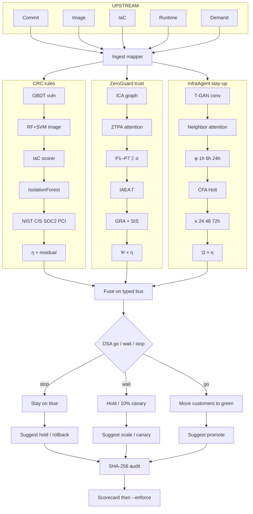
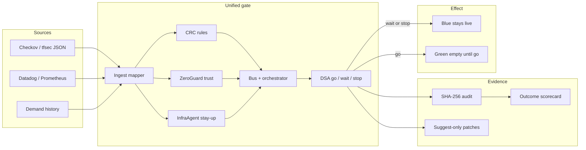
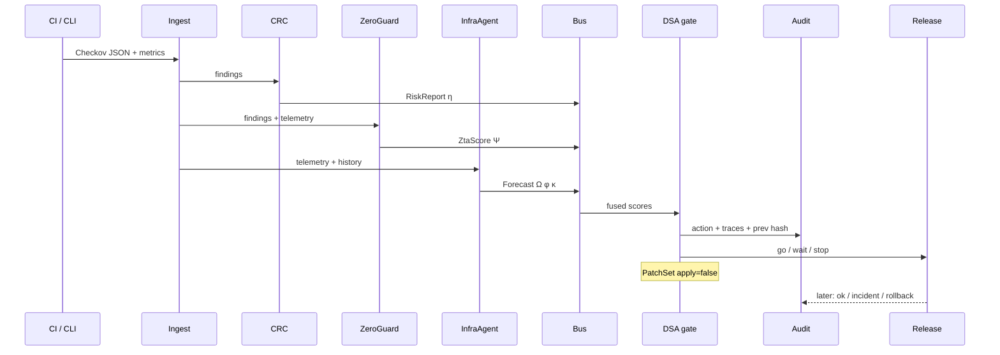
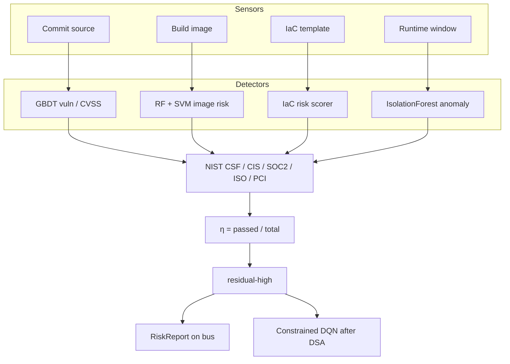
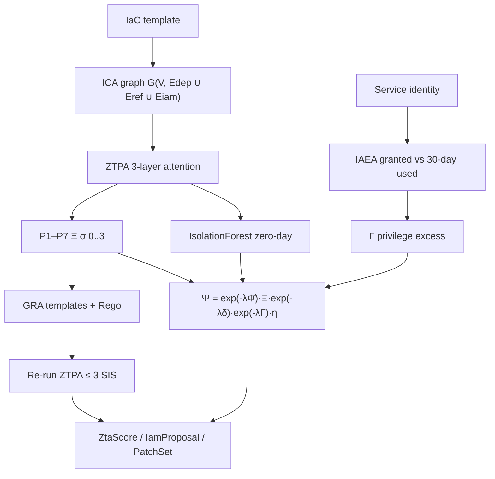
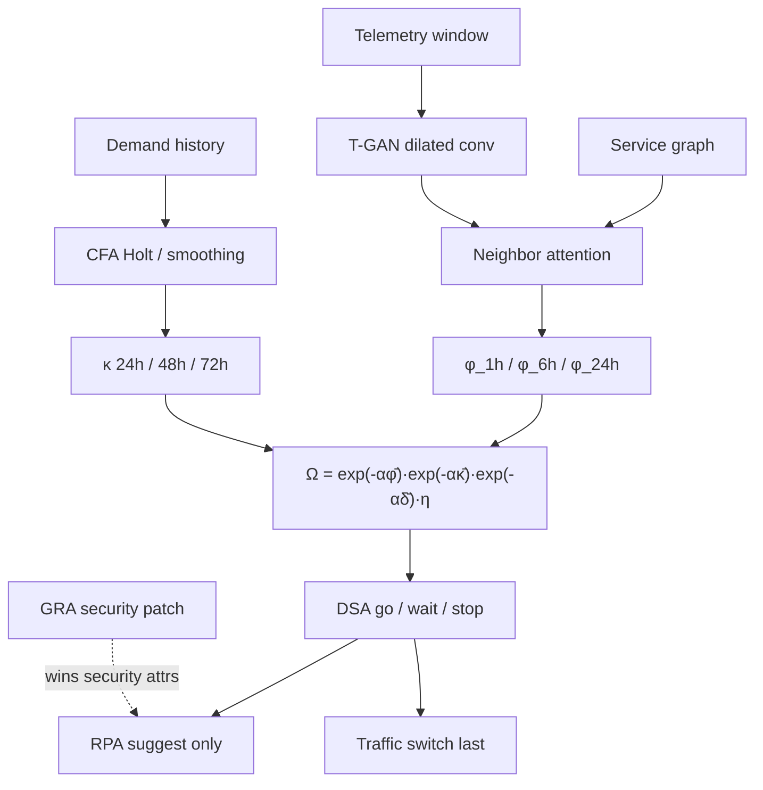

# Complete architecture

Three papers, one closed loop. CRC, ZeroGuard, and InfraAgent share a bus, an orchestrator, a signed audit, and a **single go / wait / stop**. The bank chatbot is the illustration at the bottom — not a separate product.

## All in one — upstream to downstream



```
Artifacts          Checkov / tfsec JSON          Datadog / Prometheus
(code, image, IaC, telemetry, demand history)
                         │                              │
                         └──────────┬───────────────────┘
                                    ▼
                         Ingest + alias mapper
                     framework/ingest/checkov.py
                     framework/ingest/telemetry.py
                                    │
              ┌─────────────────────┼─────────────────────┐
              ▼                     ▼                     ▼
        CRC — rules           ZeroGuard — trust     InfraAgent — stay-up
        η, residual           7 NIST pillars        φ_1h / φ_6h / φ_24h
        critical IaC          Ξ, Γ, Ψ               Holt κ, Ω
        RiskReport            ZtaScore              Forecast
        framework/crc         framework/zeroguard   framework/infraagent
              │                     │                     │
              └─────────────────────┼─────────────────────┘
                                    ▼
                    Typed priority bus + orchestrator
              safety > identity > capacity > advisory
              file-backed (audit.jsonl.bus); Redis optional
                                    │
                                    ▼
                         DSA gate  (autonomy α2)
              ALLOW | WARN | BLOCK_BUILD |
              BLOCK_DEPLOYMENT | ROLLBACK
              DQN cannot ALLOW through a BLOCK
                     │                    │
                     ▼                    ▼
              RPA suggest-only      SHA-256 audit chain
              apply = false         immutable hash link
              GRA wins security     Outcome sidecar
                                    scorecard
                                    │
                                    ▼
                         Traffic switch LAST
              blue stays live unless the pick is go
              Login → Chatbot → Fraud → Ledger → switch
```

## System context



## One pipeline run



## Three planes

| Plane | Paper | Shipped in this repo | Story / later (EB2NIW) | Question it answers |
|---|---|---|---|---|
| **CRC** | 207 | Checkov → η, debt, residual-high | Code / image / runtime detectors, constrained DQN | Did the scanner find trouble? |
| **ZeroGuard** | 2143 | 7 NIST SP 800-207 pillars, Ξ, Γ, Ψ | ICA, ZTPA, IAEA, GRA + Rego | Open doors or extra permissions? |
| **InfraAgent** | 1239 | Heuristic φ, Holt κ, Ω, DSA, suggest-only RPA | T-GAN window, CFA bands | Will it fail or run out of room? |

Join: **η multiplies both Ψ and Ω.** One orchestrator run publishes all three before the gate.

## Gate

```
BLOCK  if  φ_1h > 0.7  OR  residual-high  OR  critical IaC
WARN   if  φ_6h > 0.5  OR  any ZTA pillar < 0.5  OR  κ > 0.15
PASS   otherwise → ALLOW

Conflict: GRA owns security attributes; RPA owns traffic and capacity.
Constraint: DQN cannot weaken a DSA BLOCK.
Autonomy α2: audit, annotate, block high/critical; never auto-apply.
```

## Feedback loop

```
shadow pick  →  customers stay or move  →  record actual
     ok | incident | rollback | brownout
                    ↓
              scorecard
     false stops vs missed stops
                    ↓
         ready_for_enforce?  →  --enforce in CI
```

The signed audit is never rewritten. Outcomes append beside it (`data/outcomes.jsonl`).

---

## CRC complete flow (paper 207)



**Checkov gate (this repo):** skip the four ML sensors. `checkov -o json` is the control set. η and residual-high come from passed/failed debt. `dqn_may_allow` is already False on BLOCK.

## ZeroGuard complete flow (paper 2143)



**Checkov gate:** classify each check onto the same 7 pillars. Γ from IAM failures + `privilege_excess`. No auto-patch. GRA still wins the conflict rule when a suggestion exists.

## InfraAgent complete flow (paper 1239)



**Checkov gate:** φ from error / cpu / p95 (rising history lifts φ_6h). κ from Holt on `history.demand` or snapshot deficit. Same DSA thresholds. RPA `apply = false`.

## How they meet

```
CRC η  ×  ZeroGuard Ψ  and  InfraAgent Ω
              ↓
        one DSA pick
              ↓
   suggest-only patch   +   SHA-256 audit
              ↓
     later: ok / incident / rollback
```

