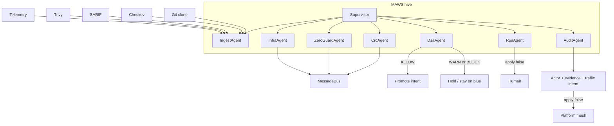

# Architecture — MAWS hive

MAWS is the supervisor. CRC, ZeroGuard, and InfraAgent remain specialist agents. One bus. One DSA pick.

CRC runs before ZeroGuard and InfraAgent because η multiplies Ψ and Ω.

Gate math is unchanged. See unified [ARCHITECTURE.md](../unified_framework/ARCHITECTURE.md) when checked out as a sibling.
